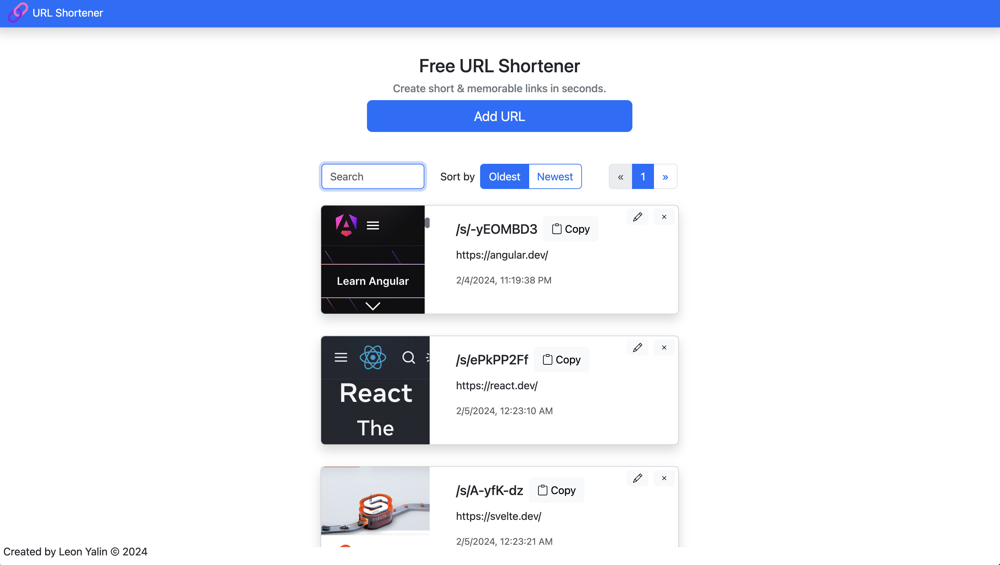

# URL Shortener Project

The URL Shortener project is a powerful tool that transforms long, unwieldy links into short, memorable, and trackable URLs. Whether you're sharing links on social media, blogs, SMS, emails, ads, or anywhere else, use this application to create concise and user-friendly URLs.



## Features

- **Link Shortening**: Easily convert long URLs into short, manageable links.
- **Preview**: View a preview of the short URL before creation.
- **Link Management**: Edit or delete saved links for better control.
- **Sorting and Searching**: Efficiently organize and find links.
- **Pagination**: Navigate through a paginated list of saved links.

## Technologies Used

- Node.js
- Express
- TypeScript
- Mongoose (MongoDB)

## Getting Started

To run the project locally, follow these steps:

1. Clone the repository:

   ```bash
   git clone <repository-url>
   ```

2. Install dependencies:

   ```bash
   npm install
   ```

3. Start the development server:

   ```bash
   npm start
   ```

4. Open the application in your web browser:

   ```
   http://localhost:3000
   ```

## Additional commands

1. Build the project:

   ```bash
   npm run build
   ```

2. Serve the previously built project:

   ```
   npm run serve
   ```

## License

This project is licensed under the [MIT License](LICENSE).

Happy Link Shortening!
